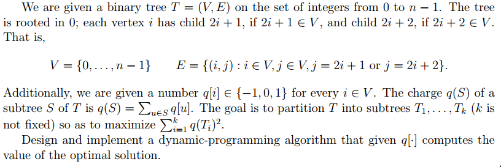

# Programming Homeworks for Algorithms (CMSC 37000) #

### HW1 ###

We say that a binary string B is sparse if there are no three consecutive 1’s in B. For instance, strings 1, 110101, 0001011 are sparse, but 111, 1100011100, 010101110101 are not. Given a sequence of non-negative weights $w_0, ..., w_{n−1}$, define the value of the string $B = b_0b_1...b_{n−1}$ as $\sum_{i=0}^{n-1}b_iw_i$.

Design and implement a polynomial-time algorithm that given a sequence $w'1,...,w_n$ finds the value of the most valuable spare string.

Compile: g++ -std=c++11 problem_solver.cpp -o problem_solver (GNU C++:)

Run your program: Make sure that file **problem_set_0.dat** is located in the same folder/directory as your executable. 

### HW2 ###

</img>

Compile: g++ -std=c++11 problem_solver.cpp -o problem_solver (GNU C++:)

Run your program: Make sure that file **problem_set_1.dat** is located in the same folder/directory as your executable. 

### HW2-extra ###

The same question with HW2 but the problem set is large so optimazation has been used to generate correct answer without cause out of memory.

Compile: g++ -std=c++11 problem_solver_large.cpp -o problem_solver_large (GNU C++:)

Run your program: Make sure that file **solution_large_1.dat** is located in the same folder/directory as your executable.